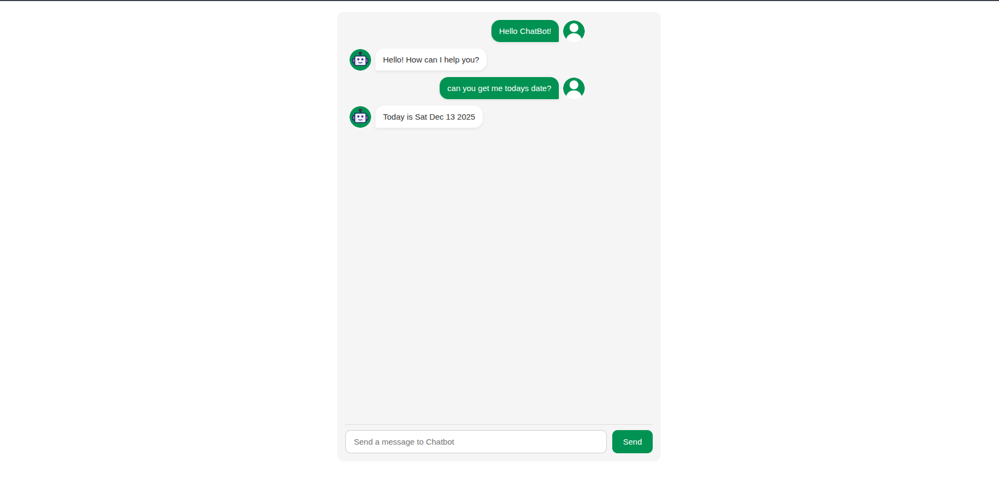

# 🤖 Web Chat Application (React + Custom Chatbot)

A simple and interactive **web chat application** built using **React and Vite**, featuring a **custom JavaScript chatbot engine** with fuzzy string matching for intelligent conversation handling.


---

## ✨ Features

### 🤖 **Intelligent Chatbot**
- **Custom JavaScript chatbot engine** (no external APIs required)
- **Fuzzy string matching** for flexible conversation handling
- **Pre-programmed responses** for common queries
- **Extensible knowledge base** with easy addition of new responses

### 💬 **Chat Interface**
- **Real-time messaging** with instant responses
- **Async chatbot responses** with realistic typing delay
- **Distinct user/bot UI** with avatar indicators
- **Scrollable chat window** that auto-scrolls to new messages
- **Responsive design** that works on mobile & desktop

### ⚡ **Technical Features**
- **Built with React + Vite** for fast development and hot reload
- **Modular component architecture** for easy maintenance
- **Unique message IDs** using `crypto.randomUUID()`
- **Clean, maintainable code** with separation of concerns
- **CSS styling** with modern design principles

---

## 📁 Project Structure

```
src/
├── Components/
│   ├── Chatbot.js          # Core chatbot logic and fuzzy matching
│   ├── UserInput.jsx        # Input handling and message submission
│   ├── UserResponse.jsx     # Message display component
│   ├── UserInput.css        # Chat interface styling
│   ├── user.png             # User avatar image
│   └── robot.png            # Bot avatar image
├── App.jsx                  # Main application component
├── main.jsx                 # Application entry point
└── index.css                # Global styles
```

---

## 🛠️ Technologies Used

- **React 18** - Frontend library for building user interfaces
- **Vite** - Next-generation frontend tooling
- **JavaScript (ES6+)** - Programming language
- **CSS3** - Styling and layout
- **crypto.randomUUID()** - Unique ID generation

---

## 📦 Installation & Setup

### Prerequisites

- Node.js (version 14 or higher)
- npm or yarn

### Step-by-Step Installation

1. **Clone the repository**
   ```bash
   git clone https://github.com/Kiran-Kumar-K17/web-chat.git
   cd web-chat
   ```

2. **Install dependencies**
   ```bash
   npm install
   # or
   yarn install
   ```

3. **Start the development server**
   ```bash
   npm run dev
   # or
   yarn dev
   ```

4. **Open your browser**
   
   Navigate to `http://localhost:5173`

### Build for Production

```bash
npm run build
# or
yarn build
```

The build output will be in the `dist/` folder, ready for deployment.

---

## 🤖 Chatbot Capabilities

The chatbot understands and responds to various inputs:

| **User Input** | **Example Phrases** | **Bot Response** |
|----------------|---------------------|------------------|
| **Greetings** | "Hello", "Hi", "Hey", "Good morning" | "Hello! How can I help you today?" |
| **Status Check** | "How are you?", "What's up?", "How's it going?" | "I'm doing great, thanks for asking!" |
| **Coin Flip** | "Flip a coin", "Toss coin", "Heads or tails" | "I flipped a coin! It's [Heads/Tails]" |
| **Dice Roll** | "Roll a dice", "Roll dice", "Random number" | "I rolled a dice! You got: [1-6]" |
| **Date/Time** | "What is the date?", "Current date", "Today's date" | "Today's date is [current date]" |
| **Gratitude** | "Thank you", "Thanks", "Appreciate it" | "You're welcome! 😊" |
| **Unknown** | Any other message | "I'm not sure how to respond to that. Try asking about the date, flipping a coin, or rolling a dice!" |

---

## 🔧 Customization

### Adding New Responses

Edit the `Chatbot.js` file and add new patterns to the chatbot's knowledge base:

```javascript
// In Chatbot.js
const responses = {
  greeting: {
    patterns: ['hello', 'hi', 'hey', 'good morning'],
    responses: ['Hello! How can I help you today?']
  },
  // Add your custom patterns here
  weather: {
    patterns: ['weather', 'temperature', 'forecast'],
    responses: ['I cannot check the weather, but it\'s always sunny in the digital world! ☀️']
  }
};
```

### Styling Changes

Modify `UserInput.css` to customize the chat interface appearance:

```css
/* Change colors, fonts, spacing, etc. */
.chat-container {
  background-color: #your-color;
  /* Add your styles */
}
```

---

## 📸 Screenshots




---
